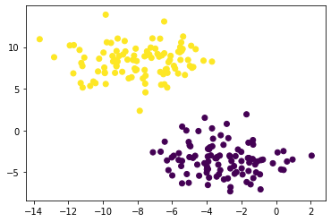
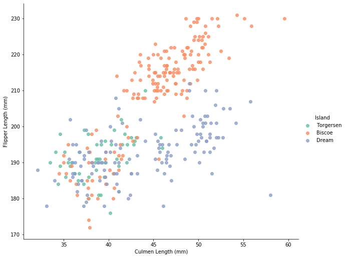
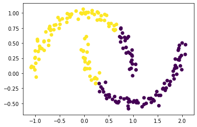
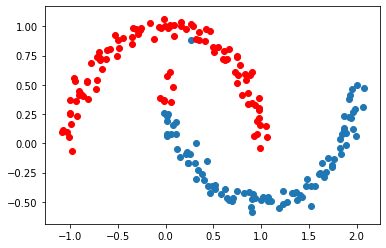
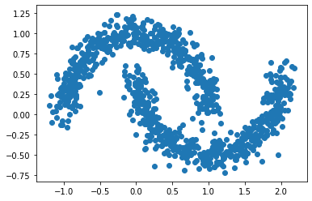
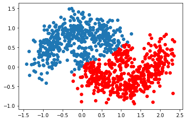
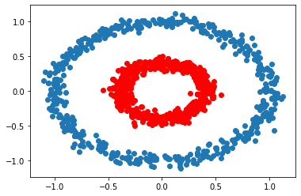
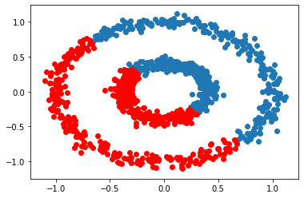
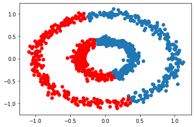

# Blog Post 2: Spectral Clustering

This is a tutorial on a simple version of the *spectral clustering* algorithm for clustering data points. 

## Introduction

### What is Clustering?

Clustering is grouping data points based on their similarities such that the data points within the same cluster or group are more similar to each other than the data points in other clusters.   

Let's look at an example.


```python
import numpy as np
from sklearn import datasets
from matplotlib import pyplot as plt
```


```python
n = 200
np.random.seed(1111)
X, y = datasets.make_blobs(n_samples=n, shuffle=True, random_state=None, centers = 2, cluster_std = 2.0)
# Euclidean coordinates of data points are in matrix X 
# labels of each point are in y
plt.scatter(X[:,0], X[:,1])
```


    <matplotlib.collections.PathCollection at 0x125af8b10>


We notice two natural circular clusters in the plot - but how do we detect them?    
We can use K-means to detect such circular clusters.


```python
from sklearn.cluster import KMeans
km = KMeans(n_clusters = 2)
km.fit(X)

plt.scatter(X[:,0], X[:,1], c = km.predict(X))
```


    <matplotlib.collections.PathCollection at 0x126bdc110>





### Harder Clustering

K-means works well for the case above since they were circular clusters. Let’s try a non-circular clustering problem.


```python
np.random.seed(1234)
n = 200
X, y = datasets.make_moons(n_samples=n, shuffle=True, noise=0.05, random_state=None)
plt.scatter(X[:,0], X[:,1])
```


    <matplotlib.collections.PathCollection at 0x1268b8f10>





We can still notice two natural clusters, but they are crescents instead of circular. Let's see how K-means performs.


```python
km = KMeans(n_clusters = 2)
km.fit(X)
plt.scatter(X[:,0], X[:,1], c = km.predict(X))
```


    <matplotlib.collections.PathCollection at 0x126c56c50>





Clearly K-means didn't work because the two crescents were not detected.     


K-means always tries to find circular clusters so it doesn't always work, especially for harder clustering problems.
This is where spectral clustering can be used instead. Let’s see how it works!


## Part A - Similarity Matrix 

For `n` number of data points in array `X`, the similarity matrix $\mathbf{A}$ is a matrix with shape `(n, n)` consisting of only 0s and 1s.     

The array `X` has two coordinates for each data point. If the Euclidean or pairwise distance between the data points at index `i` and index `j` in `X` is within a set threshold value called epsilon then for our similarity matrix `A[i,j]` is set to 0, otherwise it is set to 1. All diagonal entries of `A` are set to 0.   

We can calculate the pairwise distances of each point using the `pairwise_distances` function from `sklearn.metrics`. This function outputs a matrix with the pairwise distance i.e. the `[i,j]` entry of the output is the Euclidean distance between `X[i]` and `X[j]`.     

A Euclidean distance example:   
For data points `X[0] = [1,2]` and `X[1] = [2,4]` the Euclidean distance is `sqrt(sum of (X[i] - X[j])^2)`.        
i.e. `[1,2] - [2,4] = [-1,-2]`     
->  `square of [-1,-2] = [1,4]`     
-> `sum of [1,4] = 5`     
-> `sqrt(5)` is the euclidean distance value for our example.     
Hence, the `[0,1]` entry of the output of the `pairwise_distances` function will be `sqrt(5)`. 
If we set `epsilon = 0.4`, then `sqrt(5) > 0.4 = epsilon` so the `[0,1]` entry of our similarity matrix will be 0 since the distance between `X[0]` and `X[1]` is not within epsilon.

Let's continue with `epsilon = 0.4`. 


```python
from sklearn.metrics import pairwise_distances
epsilon = 0.4

#compute distances and compare with epsilon
A = 1*(pairwise_distances(X) < epsilon) 

#diagonal entries are set to 0
np.fill_diagonal(A, 0) 
```

## Part B - The norm cut objective

So now we know which points are similar to each other. We still need to partition into the two clusters. We can achieve this by finding the binary norm cut objective of our similarity matrix `A`. But before looking at that, we need to introduce some more expressions.

Let $C_0$ and $C_1$ be two clusters of the data points, and let's assume that every data point is in either one of the two clusters. We can find which data points belong to which cluster using the array `y` (remember we made two arrays X and y when making the dataset). `y` contains the labels of the data points i.e. if `y[i] = 1`, then the data point `i` is in cluster $C_1$ and if `y[i] = 0`, then the data point `i` is in cluster $C_0$. 

Next, let's look at $\mathbf{cut}(C_0, C_1)$ and $\mathbf{vol}(C_0)$.

- $\mathbf{cut}(C_0, C_1) \equiv \sum_{i \in C_0, j \in C_1} a_{ij}$ is the *cut* of the clusters $C_0$ and $C_1$. 
This basically indicates the number of cuts we need to make to correctly partition the points into $C_0$ and $C_1$ (remember $C_0$ and $C_1$ were found using `y`). Since our similarity matrix has only 0s and 1s, it basically indicates which points are "similar" / "connected" to each other, so they must be in the same cluster. So the cut term counts the number of times we need to "disconnect" or "cut" such "connected" points in order for them to be partitioned correctly into the clusters we found using `y`.

- $\mathbf{vol}(C_0) \equiv \sum_{i \in C_0}d_i$, where $d_i = \sum_{j = 1}^n a_{ij}$ is the *degree* of row $i$ (the $i$th row-sum of $\mathbf{A}$). The degree of a row $i$ is basically the total number of data points related or similar to data point $i$ based on $A$. The *volume* of a cluster is a measure of its size. We need this term in order to normalize the cut term.

Finally, we can now introduce the *binary norm cut objective* of a matrix $\mathbf{A}$:

$$N_{\mathbf{A}}(C_0, C_1)\equiv \mathbf{cut}(C_0, C_1)\left(\frac{1}{\mathbf{vol}(C_0)} + \frac{1}{\mathbf{vol}(C_1)}\right)\;.$$

If the binary norm cut objective is small then the data has been partitioned well into clusters $C_0$ and $C_1$. Since the amount of cuts we need to make are few and the sizes of the clusters are big.

Let's look at the Cut Term and the Volume Term one by one.


#### B.1 The Cut Term

To reiterate, the cut term $\mathbf{cut}(C_0, C_1)$ is the number of "cuts" we need to make between data points that have been found as similar to each other in `A` in order to achieve the same labels based on `y`. So if this is small, then we don't need to make as many cuts, since the labels `y` and the similarity matrix `A` correspond well to each other or paritition the data points the same way. So then there are not many points in any cluster that are "similar" or "connected" to the points in another cluster, so we don't need to cut many connections when the cut term is small.

Let's write a function called `cut(A,y)` to compute the cut term. Since $\mathbf{cut}(C_0, C_1) \equiv \sum_{i \in C_0, j \in C_1} a_{ij}$, so first we need to find the i and j values in $C_0$ and $C_1$ respectively. We can use `np.where` to get the indexes `i` for each cluster. Then we add all the entries `A[i,j]` for each pair of points `(i,j)` in $C_0$ and $C_1$ by looping over the matrix `A`.

## Better way other than looping?? update comment above too!!!


```python
def cut(A,y):
    C1 = np.where(y == 1)[0] #get index for cluster 1
    C0 = np.where(y == 0)[0] #get index for cluster 0
    # loop over A, add the value at the entry to sum
    sum = 0
    for i in C0:
        for j in C1:
            sum += A[i,j]
    return sum
```

Compute the cut objective for the true clusters `y`. Then, generate a random vector of random labels of length `n`, with each label equal to either 0 or 1. Check the cut objective for the random labels. You should find that the cut objective for the true labels is *much* smaller than the cut objective for the random labels. 

This shows that this part of the cut objective indeed favors the true clusters over the random ones. 


```python
cut(A,y)
```


    13


```python
v = np.random.randint(0, 2, size = n) #generate random labels
cut(A,v)
```


    1150


The cut objective is 13 for the true labels and 1150 for the random. These are different by a factor of more than 88. So we can see that the cut objective heavily favors the true clusters since a pair of clusters is good if the cut objective is small, and this makes the overall norm cut also small.

#### B.2 The Volume Term 

As we learnt earlier, *volume term* is a measure of the size of a cluster. So if the size of a cluster is big $C_0$, then $\mathbf{vol}(C_0)$ will be big and $\frac{1}{\mathbf{vol}(C_0)}$ will be small. Thus our norm cut objective will be small as well, which is preferred. Let's write a function `vols(A,y)` that returns the volumes of the two clusters $C_0$ and $C_1$ as a tuple i.e. (volume of $C_0$, volume of $C_1$).


```python
def vols(A,y):
    C0 = np.where(y == 0)[0] #get indexes for cluster 0
    C1 = np.where(y == 1)[0] #get indexes for cluster 1
    d = A.sum(axis = 1) #returns an array with sum of entries over each row i.e. degree of each row as in prompt
    return (sum(d[C0]), sum(d[C1]))
```

So to get a small binary norm cut objective:

1. There should be few instances in `A` for which data points in one cluster are "connected" or "joined" to a data point in another cluster based on the clusters found using `y`.
2. The sizes or volumes of both $C_0$ and $C_1$ can't be too small. 

Finally, let's write a function called `normcut(A,y)` which uses `cut(A,y)` and `vols(A,y)` to compute the binary norm cut objective of a similarity matrix `A` with array of labels `y`.


```python
def normcut(A,y):
    v0, v1 = vols(A,y) #get the volumes of two clusters
    return cut(A,y)*( (1/v0) + (1/v1) ) #use cut function to get cut objective and use equation in prompt
```

Let's compute the `normcut` objective using the true labels `y` and the random labels `v` that we had used before for the `cut` term.


```python
normcut(A,y)
```


    0.011518412331615225


```python
normcut(A,v)
```


    1.0240023597759158


The normcut objective using the true labels is smaller than using the random labels. A smaller norm cut objective means a better partition of data points. Hence, the true labels are indeed better to use to cluster the points than the random ones.

## Part C - Another equation for normcut

So if we can find a `y` for which `normcut(A,y)` is small, then our problem is solved! However, this is not so easy. In fact, it's an NP-hard combinatorial optimization problem, so this approach is not practical. 

We need to define a new vector $\mathbf{z} \in \mathbb{R}^n$ such that: 

$$
z_i = 
\begin{cases}
    \frac{1}{\mathbf{vol}(C_0)} &\quad \text{if } y_i = 0 \\ 
    -\frac{1}{\mathbf{vol}(C_1)} &\quad \text{if } y_i = 1 \\ 
\end{cases}
$$


This vector preserves the information we get from $\mathbf{y}$, because the sign of $z_i$ tells us which cluster it belongs. For example, when $z_i > 0$ (i.e. positive) then $y_i = 0$, so $i$ is in cluster $C_0$. 

We now define a diagonal matrix $\mathbf{D}$ such that $d_{ii} = d_i$, and $d_i = \sum_{j = 1}^n a_i$ is the degree of i.

Using $\mathbf{z}$ and $\mathbf{D}$, we can get another formula for the norm cut objective.

$$\mathbf{N}_{\mathbf{A}}(C_0, C_1) = 2\frac{\mathbf{z}^T (\mathbf{D} - \mathbf{A})\mathbf{z}}{\mathbf{z}^T\mathbf{D}\mathbf{z}}\;,$$

We can check if the formula above returns the same value for the norm cut objective as our `normcut(A,y)` function.     
First, let's write a function `transform(A,y)` to compute the corresponding $\mathbf{z}$ vector with `A` and `y` as inputs.


```python
def transform(A,y):
    v0, v1 = vols(A,y)
    #for indexes of cluster 0, set value at index to 1/v0, otherwise -1/v1 since in cluster 1
    z = np.where(y == 0, 1/v0, -1/v1)
    return z
```

Next, let's compute the diagonal matrix $\mathbf{D}$. 


```python
D = np.zeros((len(y), len(y))) #create a matrix of zeros
np.fill_diagonal(D, A.sum(axis = 1)) #update diagonal entries with the row sums of A
```

Now we can check that the equation above holds. We use `isclose` instead of `==` to compare the values since computer arithmetic is not exact.


```python
z = transform(A,y)
np.isclose((z@(D-A)@z)/(z@D@z),normcut(A,y))
```


    True


We can also check the identity $\mathbf{z}^T\mathbf{D}\mathbb{1} = 0$ using `isclose`.


```python
np.isclose(z@D@(np.ones(n)), 0)
```


    True


## Part D - Optimization

We know that a smaller norm cut means a better clustering. Given the equation of norm cut $\mathbf{N}_{\mathbf{A}}(C_0, C_1)$ in Part C, we basically need to minimize the function:

$$ R_\mathbf{A}(\mathbf{z})\equiv \frac{\mathbf{z}^T (\mathbf{D} - \mathbf{A})\mathbf{z}}{\mathbf{z}^T\mathbf{D}\mathbf{z}} $$

with $\mathbf{z}^T\mathbf{D}\mathbb{1} = 0$. We can inlcude this condition into the optimization by replacing $\mathbf{z}$ with the orthogonal complement of $\mathbf{z}$ relative to $\mathbf{D}\mathbb{1}$. We can write a function `orth_obj` to achieve this. We can subtract the orthogonal of $\mathbf{z}$ relative to $\mathbf{D}\mathbb{1}$ (which we find using the `orth` function) from $\mathbf{z}$ to find the orthogonal complement of $\mathbf{z}$. 


```python
def orth(u, v):
    return (u @ v) / (v @ v) * v

e = np.ones(n) 

d = D @ e

def orth_obj(z):
    z_o = z - orth(z, d)
    return (z_o @ (D - A) @ z_o)/(z_o @ D @ z_o)
```

Remember that we want to minimize our norm cut objective, that is, we need to minimize $R_\mathbf{A}(\mathbf{z})$ defined above. So now we can minimize our function `orth_obj` with respect to $\mathbf{z}$ by using `minimize` from `scipy.optimize`, returning a minimizing vector `z_min`. 


```python
from scipy.optimize import minimize
z_min = minimize(orth_obj, z).x #explicit optimization
```

## Part E - Plot the results

The sign of `z_min[i]` represents which cluster the data point at index `i` belongs to. So for all `i` where `z_min[i] < 0`, `X[i]` belong to the same cluster, and for all `j` where `z_min[j] >= 0`, `X[j]` belong to another cluster.


```python
neg = X[np.where(z_min < -0.0015)[0]] #get the first cluster based on indexes from negative values in z_min
pos = X[np.where(z_min >= -0.0015)[0]] #get the second cluster based on indexes from positive values in z_min
```


```python
plt.scatter(neg[:,0], neg[:,1])
plt.scatter(pos[:,0], pos[:,1], color = "red")
```


    <matplotlib.collections.PathCollection at 0x126e89dd0>





```python
plt.scatter(X[:,0], X[:,1], c=z_min >= -0.0015)
```


    <matplotlib.collections.PathCollection at 0x126f75290>


## UPDATED SCATTERPLOTS

## Comment on got help! Updated the way I created my scatterplot

Looks like spectral clustering indeed helped in correctly clustering the data!

## Part F - Using eigenvalues and eigenvectors instead

The explicit optimization achieves the task but it takes too long so we need to find a more practical method of optimization. We can instead use eigenvalues and eigenvectors. 

The spectrum of a matrix is defined as the set of its eigenvalues. This is the reason why the algorithm is called *spectral* clustering since we need to use eigenvalues and eigenvectors for our algorithm. 

We want to minimize the function 

$$ R_\mathbf{A}(\mathbf{z})\equiv \frac{\mathbf{z}^T (\mathbf{D} - \mathbf{A})\mathbf{z}}{\mathbf{z}^T\mathbf{D}\mathbf{z}} $$

with respect to $\mathbf{z}$, and the condition $\mathbf{z}^T\mathbf{D}\mathbb{1} = 0$. 

We need to use the Rayleigh-Ritz Theorem, which states that the minimizing vector $\mathbf{z}$ must be the the eigenvector with smallest eigenvalue of the generalized eigenvalue problem 

$$ (\mathbf{D} - \mathbf{A}) \mathbf{z} = \lambda \mathbf{D}\mathbf{z}\;, \quad \mathbf{z}^T\mathbf{D}\mathbb{1} = 0$$

this can be converted to the standard eigenvalue problem 

$$ \mathbf{D}^{-1}(\mathbf{D} - \mathbf{A}) \mathbf{z} = \lambda \mathbf{z}\;, \quad \mathbf{z}^T\mathbb{1} = 0\;.$$

This tells us that $\mathbb{1}$ is the eigenvector with the smallest eigenvalue of the matrix $\mathbf{D}^{-1}(\mathbf{D} - \mathbf{A})$. So, now we can find the minimizing vector $\mathbf{z}$, since it's the eigenvector with the *second*-smallest eigenvalue. Let's do it!

First, we construct the *Laplacian* matrix of the similarity matrix $\mathbf{A}$,     
$$\mathbf{L} = \mathbf{D}^{-1}(\mathbf{D} - \mathbf{A})$$


```python
D_inv = np.linalg.inv(D)#compute the inverse of D
L = D_inv@(D-A) #construct the Laplacian matrix
```

Next, we find the eigenvector `z_eig` with the second-smallest eigenvalue with respect to matrix $\mathbf{L}$.


```python
#find the eigenvectors and eigenvalues
Lam, U = np.linalg.eig(L)
#sort the eigenvalues
ix = Lam.argsort()
Lam, U = Lam[ix], U[:,ix]
#2nd smallest eigenvalue and corresponding eigenvector
z_eig = U[:,1]
```

Finally, we can plot the data using the sign of `z_eig` to form the clusters.


```python
plt.scatter(X[:,0], X[:,1], c=z_eig >= 0)
```


    <matplotlib.collections.PathCollection at 0x127042190>


## Part G - Create a spectral clustering function

Now that we have understood how spectral clustering works, let's create a function that does all the steps for us i.e. takes in an an array of data points and a distance threshold and returns cluster labels for each data point in the input array.


```python
def spectral_clustering(X, epsilon):
    """
    A function which takes in input data X and distance threshold epsilon to 
    perform spectral clustering.
    First, constructs the similarity matrix, and then the Laplacian matrix.
    Computes the eigenvector with second-smallest eigenvalue of the Laplacian matrix.
    Returns an array of binary labels indicating the group that data point i
    is in, based on the eigenvector.
    
    X: array of input data points
    epsilon: distance threshold
    """
    #similarity matrix
    A = 1*(pairwise_distances(X) < epsilon)
    np.fill_diagonal(A, 0) #diagonal entries are set to 0

    #laplacian matrix
    D = np.zeros((len(X), len(X)))
    np.fill_diagonal(D, A.sum(axis = 1))
    L = (np.linalg.inv(D))@(D-A)
    
    #eigenvectors and eigenvalues
    Lam, U = np.linalg.eig(L)
    # sort and get eigenvector with 2nd smallest eigenvalue
    z_eig = U[:,Lam.argsort()][:,1]
    
    return np.where(z_eig >= 0, np.zeros(len(X)), 1)
```

Let's demonstrate this function using supplied data.


```python
plt.scatter(X[:,0], X[:,1], c=spectral_clustering(X, epsilon = 0.4))
```


    <matplotlib.collections.PathCollection at 0x126fdda10>


Great! Our function works well!

## Part H - Experimenting with different datasets

We can generate different data sets to see if our function still works.

Let's make moons using:
- n = 200, noise = 0.1
- n = 1000, noise = 0.1
- n = 1000, noise = 0.2


```python
np.random.seed(1234)
n = 200
X1, y1 = datasets.make_moons(n_samples=n, shuffle=True, noise=0.1, random_state=None)
plt.scatter(X1[:,0], X1[:,1])
```


    <matplotlib.collections.PathCollection at 0x1274cb9d0>





```python
plt.scatter(X1[:,0], X1[:,1], c=spectral_clustering(X1, 0.4))
```


    <matplotlib.collections.PathCollection at 0x1275e1790>


```python
np.random.seed(1234)
n = 1000
X2, y2 = datasets.make_moons(n_samples=n, shuffle=True, noise=0.1, random_state=None)
plt.scatter(X2[:,0], X2[:,1])
```


    <matplotlib.collections.PathCollection at 0x1276e1610>


```python
plt.scatter(X2[:,0], X2[:,1], c=spectral_clustering(X2, 0.4))
```


    <matplotlib.collections.PathCollection at 0x1277f9610>





```python
np.random.seed(1234)
n = 1000
X3, y3 = datasets.make_moons(n_samples=n, shuffle=True, noise=0.2, random_state=None)
plt.scatter(X3[:,0], X3[:,1])
```


    <matplotlib.collections.PathCollection at 0x1278f1d50>


```python
plt.scatter(X3[:,0], X3[:,1], c=spectral_clustering(X3, 0.4))
```


    <matplotlib.collections.PathCollection at 0x12757af10>


We can see that as the noise increases, the data points become more spread out. Spectral clustering still appears to work as the noise increases although the clusters are less distinct.

## Part I - The Bull's Eye

Let's check how spectral clustering works for the bull's eye.


```python
n = 1000
X, y = datasets.make_circles(n_samples=n, shuffle=True, noise=0.05, random_state=None, factor = 0.4)
plt.scatter(X[:,0], X[:,1])
```


    <matplotlib.collections.PathCollection at 0x12ce0f150>


First, let's see how k-means does.


```python
km = KMeans(n_clusters = 2)
km.fit(X)
plt.scatter(X[:,0], X[:,1], c = km.predict(X))
```


    <matplotlib.collections.PathCollection at 0x1272dbb10>


As we can see, k-means does not correctly separate the two circles.

Let's check if the spectral clustering algorithm can correctly partition the two circles for values of `epsilon` between `0` and `1.0`.


```python
#epsilon = 0.2
plt.scatter(X[:,0], X[:,1], c=spectral_clustering(X, 0.2))
```


    <matplotlib.collections.PathCollection at 0x127346350>





Great! The spectral clustering correctly clusters the data points for epsilon = 0.2.


```python
#epsilon = 0.5
plt.scatter(X[:,0], X[:,1], c=spectral_clustering(X, 0.5))
```


    <matplotlib.collections.PathCollection at 0x1280b6990>





The spectral clustering still works correctly for epsilon = 0.5.


```python
#epsilon = 0.7
plt.scatter(X[:,0], X[:,1], c=spectral_clustering(X, 0.7))
```


    <matplotlib.collections.PathCollection at 0x1283cf290>





Looks like it doesn't work properly for epsilon = 0.7, but it was working for epsilon = 0.5. Let's check 0.6!


```python
#epsilon = 0.6
plt.scatter(X[:,0], X[:,1], c=spectral_clustering(X, 0.6))
```


    <matplotlib.collections.PathCollection at 0x128429b90>


The spectral clustering doesn't correctly cluster the data points for epsilon = 0.6 either.    
Therefore, we can get a rough range of values of epsilon <= 0.5, for which we can correctly separate the two rings.
